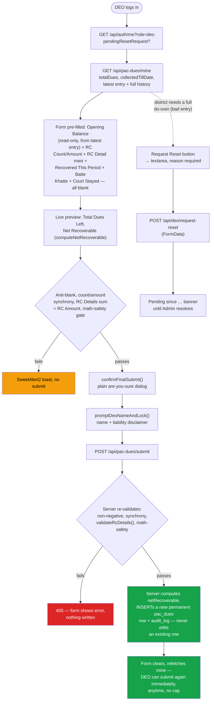
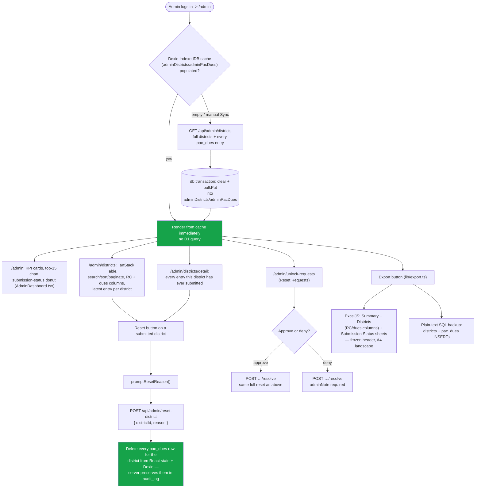

# PAC Recovery Portal

A production internal portal for the Department of Excise, Government of Uttar Pradesh, tracking
recovery of dues from cases originating up to FY ending 31-Mar-2019, across 75 districts. District
Excise Officers (DEOs) submit recovery updates whenever they have new figures — each submission is
a permanent, append-only ledger entry; an Admin reviews, exports, and can reset a district's
entire ledger back to its uploaded baseline.

See [PLAN.md](./PLAN.md) for the design record behind the append-only ledger, [CLAUDE.md](./CLAUDE.md)
for the rules an AI agent must follow when working in this repo, [SECURITY.md](./SECURITY.md) for
the security architecture, [DEPLOY.md](./DEPLOY.md) for production state and deploy commands, and
[TESTING.md](./TESTING.md) for how to test a change.

## Tech Stack

One Next.js (App Router) app on [`@opennextjs/cloudflare`](https://opennext.js.org/cloudflare),
deployed as a single Cloudflare Worker serving both UI pages and `/api/*` route handlers. Package
manager is **pnpm** throughout.

*   **Next.js 16 / React 19** — App Router. The whole app (UI pages and API routes) lives under
    `api/`. `api/app/api/*` is the API surface; everything else under `api/app/` is a page.
*   **Cloudflare D1** (`api/db/schema.ts`, Drizzle ORM) — `districts`, `users`, `pac_dues`,
    `magic_link_tokens`, `audit_log`, `unlock_requests`, `login_attempts`. Migrations tracked via
    `drizzle-kit` under `api/drizzle/`.
*   **Auth** — HttpOnly/Secure/SameSite=Lax session cookies (`jose` for JWT signing), no CORS. DEO
    login is CUG-hash verification (SHA-256, hashed client-side before the raw mobile number ever
    leaves the browser); Admin login is magic-link email (via [Resend](https://resend.com),
    `noreply@mail.exciseup.in`).
*   **Dexie.js** — IndexedDB cache on the Admin dashboard (districts + pac_dues), explicit Sync
    button to bypass it.
*   **ExcelJS** — Admin's `.xlsx` export: real frozen header rows, A4-landscape/fit-to-width print
    setup, currency formatting.
*   **TanStack Table** — the Admin Districts page's sortable/searchable/paginated grid.
*   **Cleave.js** — Indian Numeral (Lakh/Crore) input formatting on DEO money fields.
*   **SweetAlert2** — blocking confirms before irreversible actions; **Tabler Icons** — all UI
    iconography, no emojis anywhere.

## Data model

See `api/db/schema.ts` for the full column reference and inline reasoning. Key points:

*   **`districts`** — all 75 UP districts. `totalDues`/`collectedTillDate` are the one-time,
    department-sourced, read-only baseline for cases originating up to FY ending 31-Mar-2019 —
    never DEO-editable, never re-entered per period. `NULL` for the districts the department
    hasn't yet supplied figures for.
*   **`pac_dues`** — an **append-only ledger**, arbitrarily many rows per `districtId`, one per
    DEO submission, ordered by `id`/`createdAt`. Every row is immutable from the moment it's
    inserted — the submit route only ever `INSERT`s, never `UPDATE`s an existing row, and no route
    ever edits a field in place. `openingBalance` is the district's latest (highest-`id`) row's
    `netRecoverable` (or `totalDues − collectedTillDate` for a district's first-ever entry) —
    computed server-side only, never trusted from the client. See [PLAN.md](./PLAN.md) for the
    full design and why.
*   **`pac_dues.rcCount`/`rcAmount`/`rcDetails`** — RCs (Recovery Certificates) issued against
    defaulters this period. Informational only: independent of `recoveredThisPeriod`/
    `netRecoverable`, an RC tells a defaulter what they owe regardless of what's actually
    recovered. `rcDetails` is a JSON `RcDetail[]` (`rcNumber`, `rcAmount`, `stayed`) — one entry
    per RC, its amounts must sum to `rcAmount`, enforced server-side.
*   **`users`** — `role: "deo" | "admin"`. DEOs are keyed by `cugHash` (SHA-256 of their 10-digit
    CUG mobile number); admins by `email` (magic-link recipient).
*   A DEO submission can never be edited or deleted — only an Admin's district-level reset
    (`POST /api/admin/reset-district`) clears it, deleting every `pac_dues` row for that district
    at once (never a single row in place) so a fresh submit chains from the uploaded baseline
    again. The wiped rows are preserved in that reset's `audit_log` metadata, not destroyed.

**Data-entry scope**: this portal only tracks dues from cases that originated up to FY ending
31-Mar-2019 — a static bilingual banner on the DEO data-entry page, not a live date check (dues
can predate the 1970s). Recovery *entries* happen whenever a DEO has a new figure, with no cap on
how often; the underlying dues stock itself never grows.

## Calculation Logic

Computed server-side only (`lib/dues-fields.ts`'s `computeNetRecoverable()`), mirrored client-side
for a live preview:

1.  **कुल बकाया धनराशि (Total Dues Left)** = `openingBalance − recoveredThisPeriod`
2.  **शुद्ध वसूल की जाने वाली धनराशि (Net Recoverable)** = `max(0, Total Dues Left − batteKhatteAmount − courtStayedAmount)`
3.  **Submit is rejected (400)** server-side if `batteKhatteAmount > Total Dues Left`, or
    `courtStayedAmount > (Total Dues Left − batteKhatteAmount)`.
4.  **RC Details must reconcile**: if `rcCount > 0`, exactly that many `RcDetail` rows are
    required and their `rcAmount`s must sum to the period's `rcAmount` (± ₹0.01) — RCs are
    informational and never enter the Total Dues Left/Net Recoverable formulas above.

## DEO Flow (`/login` → `/deo-data-entry`)

Single-page form. CUG login → session cookie → form pre-filled with the district's current Opening
Balance (from its latest ledger entry, or the uploaded baseline if this is its first), blank
editable RC Count/Amount + per-RC breakdown, Recovered This Period/Batte Khatte/Court Stayed →
two-step submit confirm (plain "are you sure" dialog, then a name-entry prompt with a liability
disclaimer, validated against blank/digits/designation-words) → `POST /api/pac-dues/submit` inserts
a new permanent ledger entry — never locked, never edited, and the DEO can submit again immediately
with no cap on how often. A read-only "My Submissions" panel shows every entry the DEO has ever
made. If a DEO needs their district's data reset back to the baseline (e.g. a bad entry), they can
file a self-service reset request (`POST /api/deo/request-reset`) instead of waiting on the Admin
to notice.

## Admin Flow (`/admin` → `/admin/districts` → `/admin/districts/detail`)

Magic-link login (`/login` → email → `/verify`) → Dashboard (KPI cards, top-15-by-net-recoverable
chart, submission-status donut) → Districts table (search/sort/paginate, per-row Reset, Excel/SQL
export) → District Detail (every entry a district has ever had). Reset Requests and Audit Log
pages round out the admin surface. Every admin can reset a district's ledger, view all data, and
export — managing who has an admin account at all (`/admin/users`, "Manage Admins" in the profile
pill) is owner-only, gated by the `OWNER_EMAIL` secret (see `CLAUDE.md`'s Auth section). There is
still no bulk DEO provisioning.

## API (`api/app/api/*`)

Every route wrapped in `withErrorHandling()` (consistent JSON error shape + security headers).
Session auth via `requireSession(req, role)` reading the HttpOnly cookie.

| Route | Method | Purpose |
|---|---|---|
| `/api/auth/verify-cug` | POST | DEO CUG-hash login. Rate-limited per IP. |
| `/api/auth/request-magic-link` | POST | Admin login step 1 — emails a 15-min single-use link. Rate-limited per user. |
| `/api/auth/verify-magic-link` | POST | Admin login step 2 — exchanges the token for a session cookie. |
| `/api/auth/me` | GET | Session + current-period info for the logged-in user. |
| `/api/auth/logout` | POST | Clears the session cookie for the given role. |
| `/api/pac-dues/mine` | GET | DEO's district baseline + full ledger history. |
| `/api/pac-dues/submit` | POST | DEO inserts a new permanent ledger entry. |
| `/api/deo/request-reset` | POST | DEO's self-service district-reset request (FormData). |
| `/api/admin/districts` | GET | Full districts + every pac_dues ledger entry, for the Dexie cache. |
| `/api/admin/reset-district` | POST | Admin wipes every ledger entry for a district back to baseline. |
| `/api/admin/unlock-requests` | GET | List of reset requests. |
| `/api/admin/unlock-requests/resolve` | POST | Approve/deny a reset request. |
| `/api/admin/audit-log` | GET | Paginated audit trail (45-day retention, pruned on read). |
| `/api/admin/truncate-demo-data` | POST | Deletes the hardcoded `Demo District` row only. |
| `/api/admin/users` | GET, POST | Owner-only: list/add admin accounts. |
| `/api/admin/users/update` | POST | Owner-only: edit an admin's name/email/designation. |
| `/api/admin/users/delete` | POST | Owner-only: remove an admin (blocks self and last-remaining). |

## App Flow

Regenerate by hand if the flow changes materially.

### 1. Authentication (both login paths)


### 2. DEO data entry — append-only ledger, unlimited submissions



### 3. Admin dashboard — Dexie-first, reset, export



## Getting started

```bash
cd api
pnpm install
cp .dev.vars.example .dev.vars   # fill in JWT_SECRET, RESEND_API_KEY, FRONTEND_URL, FROM_EMAIL
pnpm run db:migrate:local        # apply drizzle/*.sql to the local D1 (miniflare) instance
pnpm run dev                     # http://localhost:3000 — UI only, no D1 binding
pnpm run preview                 # closer to production: builds via OpenNext, real Worker + D1
                                  # binding + asset serving on http://localhost:8787
```

## Deploying

Live at `https://pacrecovery.exciseup.in` as a single Cloudflare Worker + D1. **Never run
`wrangler deploy` or a `--remote` D1 command without the user explicitly saying so for that
specific change** — this project has live production data and real government users. There is no
CI/CD; deploys are manual, run from this machine. See [DEPLOY.md](./DEPLOY.md) for the full
production resource table, secrets, and redeploy/rollback commands.

## Scripts and Data (`scripts_and_data/`)

`.gitignore` excludes `*.sql`, `*.csv`, `*.txt`, `*.py`, `*.xlsx`, `*.xls`, anything matching
`*hash*`, and the `backups/` directory under here — the department's contact directory (real
officer names, phone numbers, CUG numbers), any D1 export/backup, and any source Excel workbook
live here locally only, never in git.
