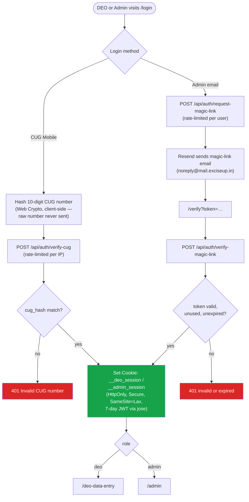
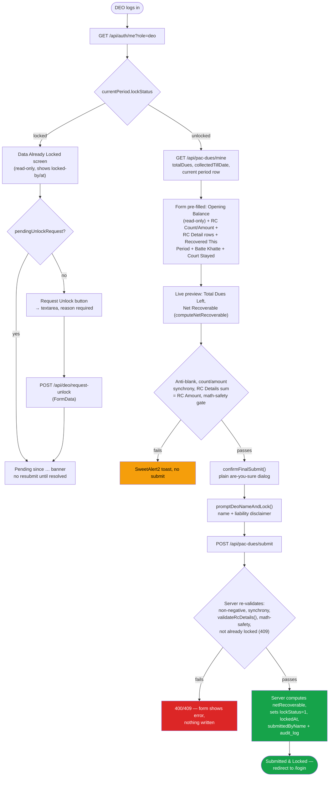
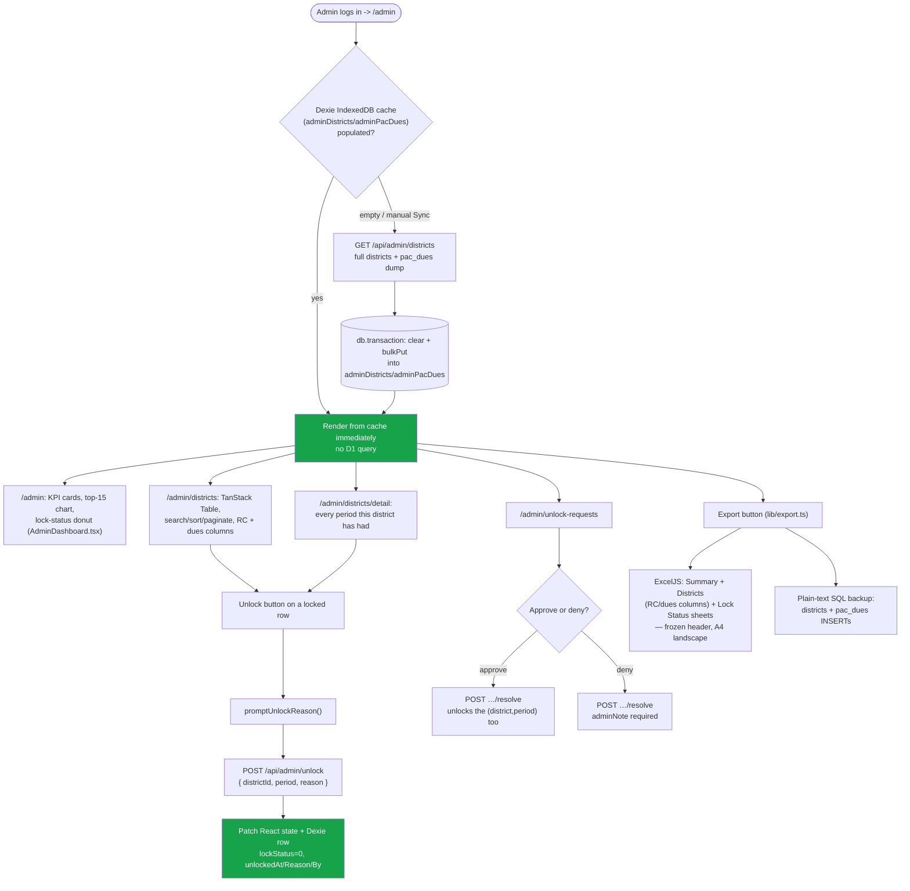

# PAC Recovery Portal

A production internal portal for the Department of Excise, Government of Uttar Pradesh, tracking
recovery of dues from cases originating up to FY ending 31-Mar-2019, across 75 districts. District
Excise Officers (DEOs) submit recovery figures every month; an Admin reviews, exports, and can
unlock a district's period for re-entry. This portal was migrated from **UP Excise Bakaya
Tracker** (a single-snapshot, static-HTML + hand-rolled-Worker app) — see
[pac-recovery-migration-plan.md](./pac-recovery-migration-plan.md) for the full migration
reasoning and [v2plan.md](./v2plan.md) for the pre-migration change history.

See [CLAUDE.md](./CLAUDE.md) for the rules an AI agent must follow when working in this repo.

## Tech Stack

One Next.js (App Router) app on [`@opennextjs/cloudflare`](https://opennext.js.org/cloudflare),
deployed as a single Cloudflare Worker serving both UI pages and `/api/*` route handlers — no
Cloudflare Pages anywhere. Package manager is **pnpm** throughout.

*   **Next.js 16 / React 19** — App Router, `app/` directory. Lives under `api/` for historical
    reasons (that directory used to hold just the backend Worker before this migration; the name
    stuck rather than being renamed, matching the sibling `excise-revenue-recovery-portal`
    project's own `api/` directory).
*   **Cloudflare D1** (`api/db/schema.ts`, Drizzle ORM) — `districts`, `users`, `pac_dues`,
    `magic_link_tokens`, `audit_log`, `unlock_requests`, `login_attempts`. Migrations tracked via
    `drizzle-kit` under `api/drizzle/`.
*   **Auth** — HttpOnly/Secure/SameSite=Lax session cookies (`jose` for JWT signing), no CORS
    needed (UI and API are a true single origin). DEO login is CUG-hash verification (SHA-256,
    hashed client-side before the raw mobile number ever leaves the browser); Admin login is
    magic-link email (via [Resend](https://resend.com), `noreply@mail.exciseup.in`).
*   **Dexie.js** — IndexedDB cache on the Admin dashboard (districts + pac_dues), explicit Sync
    button to bypass it.
*   **ExcelJS** — Admin's `.xlsx` export: real frozen header rows, A4-landscape/fit-to-width print
    setup, currency formatting. Not a SheetJS-family library — see CLAUDE.md's UI conventions.
*   **TanStack Table** — the Admin Districts page's sortable/searchable/paginated grid.
*   **Cleave.js** — Indian Numeral (Lakh/Crore) input formatting on DEO money fields.
*   **SweetAlert2** — blocking confirms before irreversible actions; **Tabler Icons** — all UI
    iconography, no emojis anywhere.

## Data model

See `api/db/schema.ts` for the full column reference and inline reasoning. Key points:

*   **`districts`** — all 75 UP districts (matching `excise-revenue-recovery-portal`'s list).
    `totalDues`/`collectedTillDate` are the one-time, department-sourced, read-only baseline for
    cases originating up to FY ending 31-Mar-2019 — never DEO-editable, never re-entered per
    period. `NULL` for the districts this portal hasn't yet received department figures for.
*   **`pac_dues`** — the recurring **monthly** snapshot, one row per `(districtId, period)`
    (`period` is `"YYYY-MM"`). `openingBalance` is the prior period's `netRecoverable` (or
    `totalDues − collectedTillDate` for a district's first period ever) — computed server-side
    only, never trusted from the client. Lock/unlock, `lockedAt`, `submittedByName`, and unlock
    metadata (`unlockedAt`/`unlockReason`/`unlockedBy`) all live here, **per period** — unlike the
    original single-snapshot version (or the reference project's district-lifetime lock), a
    district's lock state is scoped to one month, not forever.
*   **`pac_dues.rcCount`/`rcAmount`/`rcDetails`** — RCs (Recovery Certificates) issued against
    defaulters this period, ported in from `excise-revenue-recovery-portal`'s `pac_data.rc_*`
    fields. Informational only: independent of `recoveredThisPeriod`/`netRecoverable`, an RC
    tells a defaulter what they owe regardless of what's actually recovered. `rcDetails` is a
    JSON `RcDetail[]` (`rcNumber`, `rcAmount`, `stayed`) — one entry per RC, its amounts must sum
    to `rcAmount`, enforced server-side (never trusted from the client).
*   **`users`** — `role: "deo" | "admin"`. DEOs are keyed by `cugHash` (SHA-256 of their 10-digit
    CUG mobile number); admins by `email` (magic-link recipient).
*   No "Open Next Period" mechanic is built yet — see `pac-recovery-migration-plan.md` §3. Today
    every district has exactly the one period the legacy-data migration seeded.

**Data-entry scope**: this portal only tracks dues from cases that originated up to FY ending
31-Mar-2019 — a static bilingual banner on the DEO data-entry page, not a live date check (dues
can predate the 1970s). Recovery *entries* happen in real time, monthly; the underlying dues stock
itself never grows.

## Calculation Logic

Computed server-side only (`lib/dues-fields.ts`'s `computeNetRecoverable()`), mirrored client-side
for a live preview:

1.  **कुल बकाया धनराशि (Total Dues Left)** = `openingBalance − recoveredThisPeriod`
2.  **शुद्ध वसूल की जाने वाली धनराशि (Net Recoverable)** = `max(0, Total Dues Left − batteKhatteAmount − courtStayedAmount)`
3.  **Submit is rejected (400)** server-side if `batteKhatteAmount > Total Dues Left`, or
    `courtStayedAmount > (Total Dues Left − batteKhatteAmount)`.
4.  **RC Details must reconcile**: if `rcCount > 0`, exactly that many `RcDetail` rows are
    required and their `rcAmount`s must sum to the period's `rcAmount` (± ₹0.01) — RCs are
    informational and never enter the Total Dues Left/Net Recoverable formulas above.

## DEO Flow (`/login` → `/deo-data-entry`)

Single-page form (no multi-step wizard — this domain has one period at a time, not a multi-year
loop). CUG login → session cookie → form pre-filled from the district's current period (read-only
Total Dues/Opening Balance, editable RC Count/Amount + per-RC breakdown, Recovered This
Period/Batte Khatte/Court Stayed) → two-step
lock confirm (plain "are you sure" dialog, then a name-entry prompt with a liability disclaimer,
validated against blank/digits/designation-words) → `POST /api/pac-dues/submit` locks the period.
A locked DEO can file a self-service unlock request (`POST /api/deo/request-unlock`) instead of
waiting on the Admin to notice.

## Admin Flow (`/admin` → `/admin/districts` → `/admin/districts/detail`)

Magic-link login (`/login` → email → `/verify`) → Dashboard (KPI cards, top-15-by-net-recoverable
chart, lock-status donut) → Districts table (search/sort/paginate, per-row Unlock, Excel/SQL
export) → District Detail (every period a district has ever had, not a fixed year-column matrix).
Unlock Requests and Audit Log pages round out the admin surface. No multi-admin `/admin/users` or
bulk DEO provisioning in this version — dropped from the reference project's feature set as out of
scope for now (see `pac-recovery-migration-plan.md` §6.2).

## API (`api/app/api/*`)

Every route wrapped in `withErrorHandling()` (consistent JSON error shape + security headers).
Session auth via `requireSession(req, role)` reading the HttpOnly cookie — no `X-API-Secret`-style
shared-secret header anywhere, since UI and API share an origin.

| Route | Method | Purpose |
|---|---|---|
| `/api/auth/verify-cug` | POST | DEO CUG-hash login. Rate-limited per IP. |
| `/api/auth/request-magic-link` | POST | Admin login step 1 — emails a 15-min single-use link. Rate-limited per user. |
| `/api/auth/verify-magic-link` | POST | Admin login step 2 — exchanges the token for a session cookie. |
| `/api/auth/me` | GET | Session + current-period info for the logged-in user. |
| `/api/auth/logout` | POST | Clears the session cookie for the given role. |
| `/api/pac-dues/mine` | GET | DEO's district baseline + current period row. |
| `/api/pac-dues/submit` | POST | DEO submits + locks the current period. |
| `/api/deo/request-unlock` | POST | DEO's self-service unlock request (FormData). |
| `/api/admin/districts` | GET | Full districts + pac_dues dump, for the Dexie cache. |
| `/api/admin/unlock` | POST | Admin unlocks a `(district, period)`. |
| `/api/admin/unlock-requests` | GET | List of unlock requests. |
| `/api/admin/unlock-requests/resolve` | POST | Approve/deny an unlock request. |
| `/api/admin/audit-log` | GET | Paginated audit trail (30-day retention, pruned on read). |
| `/api/admin/truncate-demo-data` | POST | Deletes the hardcoded `Demo District` row only. |

## App Flow

Snapshot as of this build — regenerate by hand if the flow changes materially.

### 1. Authentication (both login paths)



### 2. DEO data entry — single period, no wizard



### 3. Admin dashboard — Dexie-first, unlock, export



## Getting started

```bash
cd api
pnpm install
cp .dev.vars.example .dev.vars   # fill in JWT_SECRET, RESEND_API_KEY, FRONTEND_URL, FROM_EMAIL
pnpm run db:migrate:local        # apply drizzle/*.sql to the local D1 (miniflare) instance
pnpm run dev                     # http://localhost:3000 — UI only, no D1 binding
pnpm run preview                 # closer to production: builds via OpenNext, real Worker + D1
                                  # binding + asset serving on http://localhost:8787
```

## Deploying

Live at `https://pacrecovery.exciseup.in` (Cloudflare Workers Custom Domain — auto-provisions its
own DNS on deploy, see `api/wrangler.jsonc`'s `custom_domain: true` route) as a single Cloudflare
Worker + D1. **Never run `wrangler deploy`, a `--remote` D1 command, or push to `main` (which
triggers `deploy.yml`) without the user explicitly saying so for that specific change** — this
project has live production data and real government users.

*   `.github/workflows/ci.yml` — `tsc --noEmit` + `next build` on every push/PR touching `api/`.
*   `.github/workflows/deploy.yml` — `pnpm run deploy` on push to `main`, requires
    `CLOUDFLARE_API_TOKEN`/`CLOUDFLARE_ACCOUNT_ID` in GitHub Secrets.
*   Remote secrets (Wrangler secrets, not `wrangler.jsonc` vars): `JWT_SECRET`, `RESEND_API_KEY`,
    `FRONTEND_URL`, `FROM_EMAIL`.

## Scripts and Data (`scripts_and_data/`)

`.gitignore` excludes `*.sql`, `*.csv`, `*.txt`, `*.py`, anything matching `*hash*`, and the
`backups/` directory under here — the department's contact directory (real officer names, phone
numbers, CUG numbers) and any D1 export/backup taken during this migration live here locally only,
never in git. See CLAUDE.md's Security section for what happened when this wasn't enforced and how
it was fixed.
